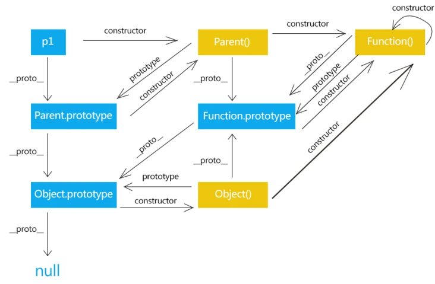

## 原型链
```javascript
var Parent = function(){

}
//定义一个函数，那它只是一个普通的函数，下面我们让这个函数变得不普通
var p1 = new Parent();
//这时这个Parent就不是普通的函数了，它现在是一个构造函数。因为通过new关键字调用了它
//创建了一个Parent构造函数的实例 p1
```

## 前提：constructor， __proto__，prototype
1.constructor、 __proto__属性是对象所独有的；
2. prototype属性是函数独有的；
3. 上面说过js中函数也是对象的一种，那么函数同样也有属性constructor、 __proto__

prototype ：
设计之初就是为了实现继承，让由特定函数创建的所有实例共享属性和方法，不需要为多个实例创建属性方法，而是将属性方法创建在构造函数的原型对象上（prototype）。那些不需要共享的才创建在构造函数中。原型属性，原型方法

Parent.prototype.name = "我是原型属性，所有实例都可以读取到我";

__proto__
相当于通往prototype（“琅琊福地”）唯一的路（指针）
让“徒弟”、“徒孙” 们找到自己“师父”、“师父的师父” 提供给自己的方法和属性

```javascript
p1.__proto__ === Parent.prototype; // true


Parent.prototype.__proto__ === Object.prototype; //true
```


一层层的往上朝，就是原型链。

constructor属性
是让“徒弟”、“徒孙” 们知道是谁创造了自己，这里可不是“师父”啊

## 总结：
说到继承，JavaScript 只有一种结构：对象。
每个实例对象（ object ）都有一个私有属性（称之为 __proto__ ）指向它的构造函数的原型对象（prototype ）。该原型对象也有一个自己的原型对象( __proto__ ) 。
该原型对象也有一个自己的原型对象( __proto__ ) ，层层向上直到一个对象的原型对象为 null。根据定义，null 没有原型，并作为这个原型链中的最后一个环节。



## hasOwnProperty，hasProperty，
hasOwnProperty: 对象自身属性，不包含从原型链上继承的属性。
for in 遍历所有可枚举属性。

## 实例方法 和 静态方法
say是静态方法，没在原型链上，不能被继承。   getName是可以被实例访问。
```javascript
var Person=function(){};
Person.say=function(){
    console.log('I am a Person,I can say.')
};
Person.prototype.getName=function(name){
    console.log('My name is '+name);
}
Person.say()//静态方法
new Person().getName()//实例方法
```


