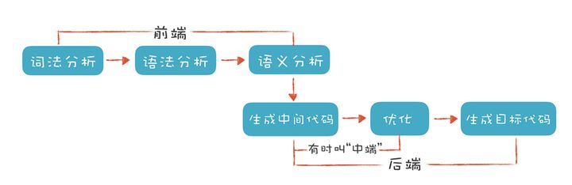
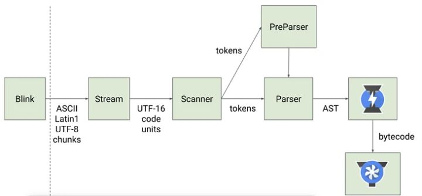
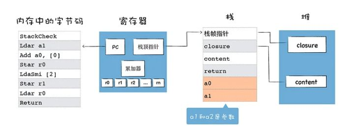
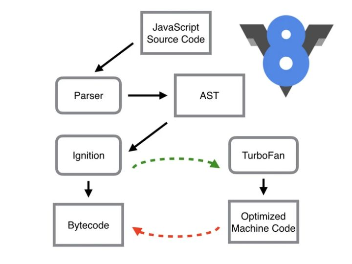

## 浏览器单进程架构
浏览器所有功能都在一个进程内运行。

缺点
1. 不稳定：某个页面代码/插件崩了，导致浏览器整个就崩了。
2. 不流畅：某个页面代码执行耗时，会阻塞进程，导致其他页面的代码也没法响应；
3. 不安全：所有资源/数据都是公用的，可以获得操作系统权限，有安全风险。

## 浏览器多进程架构

1. 浏览器主进程
  负责界面展示，用户交互，子进程管理，存储。
2. 渲染进程
  将html，css，js转换成用户可交互等页面。渲染引擎blink和js引擎V8都运行在该进程中。
  默认情况下，浏览器给每个tab页都分配一个渲染进程。彼此独立。处于安全考虑，渲染进程都运行在沙箱模式下。沙箱：不能在硬盘上写入任何数据，也不能在敏感位置读取任何数据
  特殊情况：
  - 一些性能较差的机器，浏览器这些进程还是会合并。
  - 浏览器打开较多tab时，可能四五十个的时候，如果从一个页面打开了另个页面，且两个页面属于同一个站点的时，新页面会复用父页面的渲染进程，因此可以看到有时候一个页面崩溃，同一站点的其他页面也崩了。
  - iframe也是单独一个进程。

  概念：
  blink与v8的关系： blink是渲染引擎，v8是blink内置的js引擎。
  webkit和blink的关系： webkit是apple主导的渲染引擎。chrome重构了下webkit，改名blink，大体架构相同。但是，webkit的js引擎是jscore，blink的js引擎是v8.

3. 网络进程
  网络资源加载。
4. GPU进程
  GPU最初是为了实现3d css效果，后来ui界面也都选择用GPU绘制。
5. storage service
  访问文件等
6. audio service
  处理音频
7. 插件进程
因为插件质量良莠不齐，但它又运行在整个浏览器中，所以需要给他单独分配进程，避免插件崩溃对浏览器和页面造成影响

多进程模型对缺点：
1. 更多的资源占用，因为每个进程都要分配单独的资源。
2. 更复杂的结构。

## V8引擎
简单的说，v8是一款js引擎，为啥需要js引擎呢？
cpu只认识自己的指令集，指令集对应着汇编代码。并且不同类型的cpu的指令集是不同的。js引擎可以将js代码编译为不同cpu（intel，ARM，MIPS等）对应的汇编代码。

备注：整个过程：高级语言-》汇编代码-》机器指令（二进制）。

v8则是chrome和nodejs，安卓设备在用的js引擎，也是目前使用最广泛的js引擎（也可称为js虚拟机）。
D8 是调试工具，用于查看v8在执行js过程中的各种中间数据，比如作用域、AST、字节码、优化的二进制代码、垃圾回收的状态，还可以使用 d8 提供的私有 API 查看一些内部信息。

v8引擎的内部结构
V8 是一个非常复杂的项目，有超过 100 万行 C++代码。它由许多子模块构成，其中这 4 个模块是最重要的：
### Parse
负责将js源代码转换为AST（抽象语法树：abstract syntax tree）。这里涉及到编译原理的知识，所以先理清下一些基础的编译原理的概念。

#### 编译原理的流程：

词法分析（lexical analysis或者scanning）和词法分析程序（lexical analyzer 或 scanner）：对源程序的字符流进行扫描，根据构词规则识别成单词。整个过程也就是“分词”。

语法分析（syntax analysis）和语法分析程序（parser）：将词法分析基础上的单词组合成各类型语法短句。如 if语句，for语句等。

语义分析（syntax analysis）：进行语义检查。
#### parse流程

### Ignition
<tweet>
即解释器，负责将 AST 转换为 Bytecode，解释执行 Bytecode；同时收集 TurboFan 优化编译所需的信息，比如函数参数的类型；解释器执行时主要有四个模块，内存中的字节码、寄存器、栈、堆。
</tweet>

#### 解释器的流程

参考资料：[解释器是如何解释执行字节码的?](https://time.geekbang.org/column/article/224908){:target="_blank"}

### TurboFan

 <tweet>
 compiler，即编译器，利用 Ignition 所收集的类型信息，将 Bytecode 转换为优化的汇编代码；
 </tweet>

### Orinoco

<tweet>
garbage collector，垃圾回收模块，负责将程序不再需要的内存空间回收。
</tweet>

总结：

简单地说，Parser 将 JS 源码转换为 AST，然后 Ignition 将 AST 转换为 Bytecode，最后 TurboFan 将 Bytecode 转换为经过优化的 Machine Code(实际上是汇编代码)。