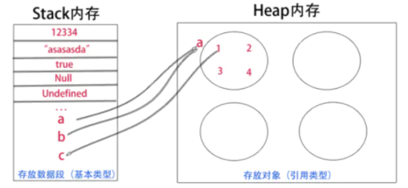

js数据类型

- 基础 boolean，string，number，undefined，null， symbol 。小。内存不变，放在栈里，便于内存分配和释放。可以搞各种数据结构。

- 引用 array function object 。堆。栈里保存指针引用，动态分配内存，

内存分配，存取，内存回收。
栈： 线性有序存储，容量小，系统分配效率高。栈优点：存取速度比堆快，仅次于直接位于CPU中的寄存器，数据可以共享；

堆：首先要在堆内存新分配存储区域，之后又要把指针存储到栈内存中，效率相对就要低一些了。  

基本类型在当前执行环境结束时销毁，引用类型不会随执行环境结束而销毁，只有当所有引用它的变量不存在时这个对象才被垃圾回收机制回收。

<small>栈/堆示意图</small>