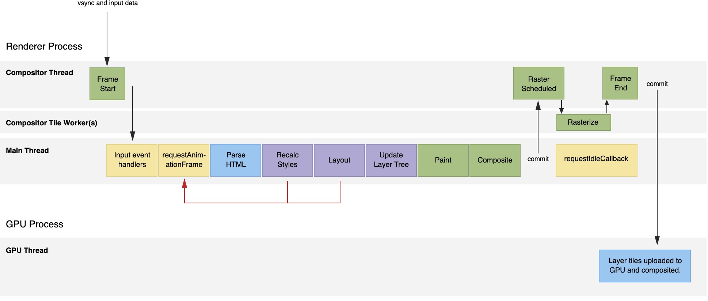
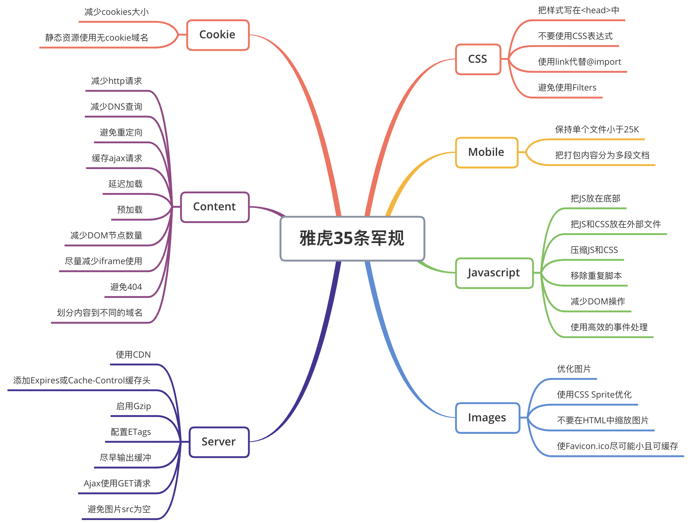
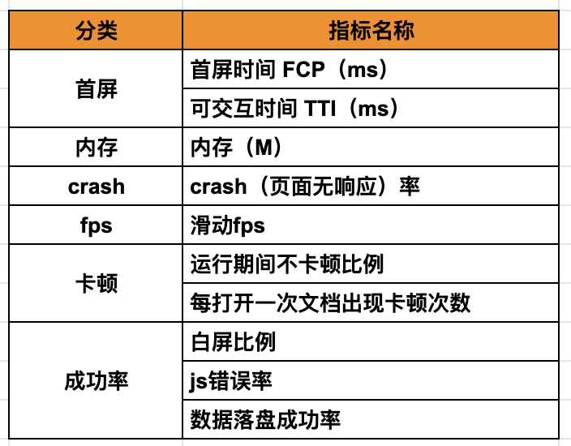

定义：
快，交互流畅 视觉稳定性
页面渲染流程：

雅虎军规：cookie content server mobile css  js image

7大方面：
度量指标：
FCP LCP FID CLS
工具：
本地开发： chrome devtools，lighthouse
线上数据：pageSpeed Insights
历史数据：Chrome User Experience Report API

