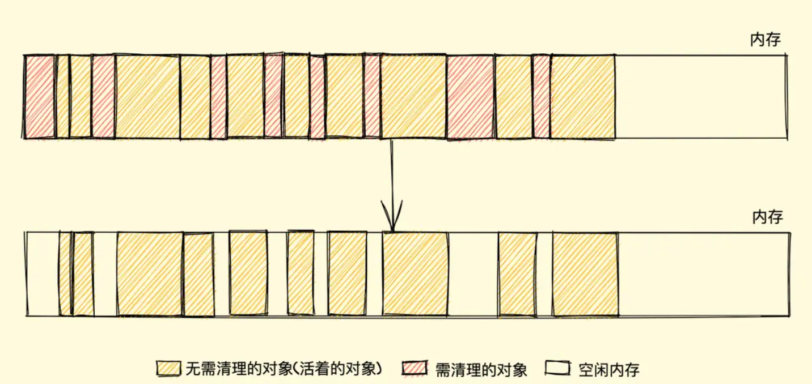
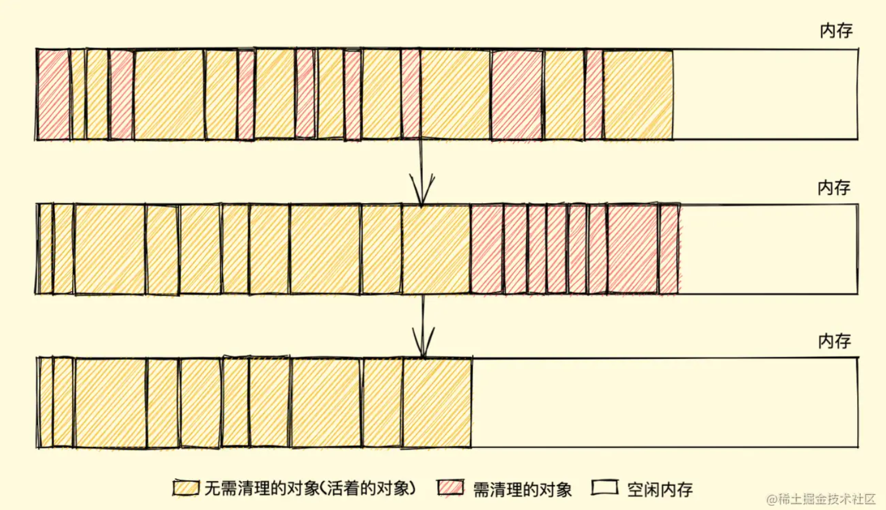

## 简介
像C语言这样的底层语言一般都有底层的内存管理接口，比如 malloc()和free()。相反，JavaScript是在创建变量（对象，字符串等）时自动进行了分配内存，并且在不使用它们时“自动”释放。 释放的过程称为垃圾回收。这个“自动”是混乱的根源，并让JavaScript（和其他高级语言）开发者错误的感觉他们可以不关心内存管理。 

内存生命周期
不管什么程序语言，内存生命周期基本是一致的：   

分配你所需要的内存
使用分配到的内存（读、写）
不需要时将其释放\归还
所有语言第二部分都是明确的。第一和第三部分在底层语言中是明确的，但在像JavaScript这些高级语言中，大部分都是隐含的。

JavaScript 的内存分配
值的初始化
为了不让程序员费心分配内存，JavaScript 在定义变量时就完成了内存分配。
```javascript
var n = 123; // 给数值变量分配内存
var s = "azerty"; // 给字符串分配内存

var o = {
  a: 1,
  b: null
}; // 给对象及其包含的值分配内存

// 给数组及其包含的值分配内存（就像对象一样）
var a = [1, null, "abra"];

function f(a){
  return a + 2;
} // 给函数（可调用的对象）分配内存

// 函数表达式也能分配一个对象
someElement.addEventListener('click', function(){
  someElement.style.backgroundColor = 'blue';
}, false);
```
通过函数调用分配内存
有些函数调用结果是分配对象内存：
```javascript
var d = new Date(); // 分配一个 Date 对象

var e = document.createElement('div'); // 分配一个 DOM 元素
Copy to Clipboard
有些方法分配新变量或者新对象：

var s = "azerty";
var s2 = s.substr(0, 3); // s2 是一个新的字符串
// 因为字符串是不变量，
// JavaScript 可能决定不分配内存，
// 只是存储了 [0-3] 的范围。

var a = ["ouais ouais", "nan nan"];
var a2 = ["generation", "nan nan"];
var a3 = a.concat(a2);
// 新数组有四个元素，是 a 连接 a2 的结果
```
使用值
使用值的过程实际上是对分配内存进行读取与写入的操作。读取与写入可能是写入一个变量或者一个对象的属性值，甚至传递函数的参数。

当内存不再需要使用时释放
大多数内存管理的问题都在这个阶段。在这里最艰难的任务是找到“哪些被分配的内存确实已经不再需要了”。它往往要求开发人员来确定在程序中哪一块内存不再需要并且释放它。

高级语言解释器嵌入了“垃圾回收器”，它的主要工作是跟踪内存的分配和使用，以便当分配的内存不再使用时，自动释放它。这只能是一个近似的过程，因为要知道是否仍然需要某块内存是无法判定的（无法通过某种算法解决）。

垃圾回收
如上文所述自动寻找是否一些内存“不再需要”的问题是无法判定的。因此，垃圾回收实现只能有限制的解决一般问题。本节将解释必要的概念，了解主要的垃圾回收算法和它们的局限性。

引用
垃圾回收算法主要依赖于引用的概念。在内存管理的环境中，一个对象如果有访问另一个对象的权限（隐式或者显式），叫做一个对象引用另一个对象。例如，一个Javascript对象具有对它原型的引用（隐式引用）和对它属性的引用（显式引用）。

在这里，“对象”的概念不仅特指 JavaScript 对象，还包括函数作用域（或者全局词法作用域）。

引用计数垃圾收集
这是最初级的垃圾收集算法。此算法把“对象是否不再需要”简化定义为“对象有没有其他对象引用到它”。如果没有引用指向该对象（零引用），对象将被垃圾回收机制回收。

示例
```javascript
var o = {
  a: {
    b:2
  }
};
// 两个对象被创建，一个作为另一个的属性被引用，另一个被分配给变量o
// 很显然，没有一个可以被垃圾收集


var o2 = o; // o2变量是第二个对“这个对象”的引用

o = 1;      // 现在，“这个对象”只有一个o2变量的引用了，“这个对象”的原始引用o已经没有

var oa = o2.a; // 引用“这个对象”的a属性
               // 现在，“这个对象”有两个引用了，一个是o2，一个是oa

o2 = "yo"; // 虽然最初的对象现在已经是零引用了，可以被垃圾回收了
           // 但是它的属性a的对象还在被oa引用，所以还不能回收

oa = null; // a属性的那个对象现在也是零引用了
           // 它可以被垃圾回收了
```
限制：循环引用
该算法有个限制：无法处理循环引用的事例。在下面的例子中，两个对象被创建，并互相引用，形成了一个循环。它们被调用之后会离开函数作用域，所以它们已经没有用了，可以被回收了。然而，引用计数算法考虑到它们互相都有至少一次引用，所以它们不会被回收。
```javascript
function f(){
  var o = {};
  var o2 = {};
  o.a = o2; // o 引用 o2
  o2.a = o; // o2 引用 o

  return "azerty";
}

f();
```
实际例子
IE 6, 7 使用引用计数方式对 DOM 对象进行垃圾回收。该方式常常造成对象被循环引用时内存发生泄漏：
```javascript
var div;
window.onload = function(){
  div = document.getElementById("myDivElement");
  div.circularReference = div;
  div.lotsOfData = new Array(10000).join("*");
};
```
在上面的例子里，myDivElement 这个 DOM 元素里的 circularReference 属性引用了 myDivElement，造成了循环引用。如果该属性没有显示移除或者设为 null，引用计数式垃圾收集器将总是且至少有一个引用，并将一直保持在内存里的 DOM 元素，即使其从DOM 树中删去了。如果这个 DOM 元素拥有大量的数据 (如上的 lotsOfData 属性)，而这个数据占用的内存将永远不会被释放。

标记清除算法
策略
标记清除（Mark-Sweep），目前在 JavaScript引擎 里这种算法是最常用的，到目前为止的大多数浏览器的 JavaScript引擎 都在采用标记清除算法，只是各大浏览器厂商还对此算法进行了优化加工，且不同浏览器的 JavaScript引擎 在运行垃圾回收的频率上有所差异
就像它的名字一样，此算法分为 标记 和 清除 两个阶段，标记阶段即为所有活动对象做上标记，清除阶段则把没有标记（也就是非活动对象）销毁
你可能会疑惑怎么给变量加标记？其实有很多种办法，比如当变量进入执行环境时，反转某一位（通过一个二进制字符来表示标记），又或者可以维护进入环境变量和离开环境变量这样两个列表，可以自由的把变量从一个列表转移到另一个列表，当前还有很多其他办法。其实，怎样标记对我们来说并不重要，重要的是其策略
引擎在执行 GC（使用标记清除算法）时，需要从出发点去遍历内存中所有的对象去打标记，而这个出发点有很多，我们称之为一组 根 对象，而所谓的根对象，其实在浏览器环境中包括又不止于 全局Window对象、文档DOM树 等
整个标记清除算法大致过程就像下面这样

垃圾收集器在运行时会给内存中的所有变量都加上一个标记，假设内存中所有对象都是垃圾，全标记为0
然后从各个根对象开始遍历，把不是垃圾的节点改成1
清理所有标记为0的垃圾，销毁并回收它们所占用的内存空间
最后，把所有内存中对象标记修改为0，等待下一轮垃圾回收

优点
标记清除算法的优点只有一个，那就是实现比较简单，打标记也无非打与不打两种情况，这使得一位二进制位（0和1）就可以为其标记，非常简单
缺点
标记清除算法有一个很大的缺点，就是在清除之后，剩余的对象内存位置是不变的，也会导致空闲内存空间是不连续的，出现了 内存碎片（如下图），并且由于剩余空闲内存不是一整块，它是由不同大小内存组成的内存列表，这就牵扯出了内存分配的问题。

假设我们新建对象分配内存时需要大小为 size，由于空闲内存是间断的、不连续的，则需要对空闲内存列表进行一次单向遍历找出大于等于 size 的块才能为其分配：

那如何找到合适的块呢？我们可以采取下面三种分配策略


First-fit，找到大于等于 size 的块立即返回


Best-fit，遍历整个空闲列表，返回大于等于 size 的最小分块


Worst-fit，遍历整个空闲列表，找到最大的分块，然后切成两部分，一部分 size 大小，并将该部分返回


这三种策略里面 Worst-fit 的空间利用率看起来是最合理，但实际上切分之后会造成更多的小块，形成内存碎片，所以不推荐使用，对于 First-fit 和 Best-fit 来说，考虑到分配的速度和效率 First-fit 是更为明智的选择
综上所述，标记清除算法或者说策略就有两个很明显的缺点

内存碎片化，空闲内存块是不连续的，容易出现很多空闲内存块，还可能会出现分配所需内存过大的对象时找不到合适的块
分配速度慢，因为即便是使用 First-fit 策略，其操作仍是一个 O(n) 的操作，最坏情况是每次都要遍历到最后，同时因为碎片化，大对象的分配效率会更慢

PS：标记清除算法的缺点补充
归根结底，标记清除算法的缺点在于清除之后剩余的对象位置不变而导致的空闲内存不连续，所以只要解决这一点，两个缺点都可以完美解决了
而 标记整理（Mark-Compact）算法 就可以有效地解决，它的标记阶段和标记清除算法没有什么不同，只是标记结束后，标记整理算法会将活着的对象（即不需要清理的对象）向内存的一端移动，最后清理掉边界的内存（如下图）


参考地址：https://juejin.cn/post/6981588276356317214


