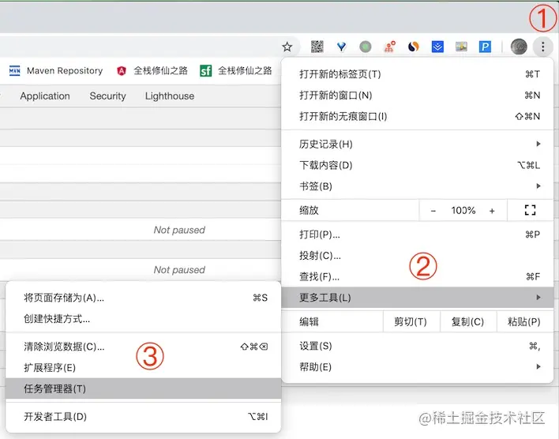
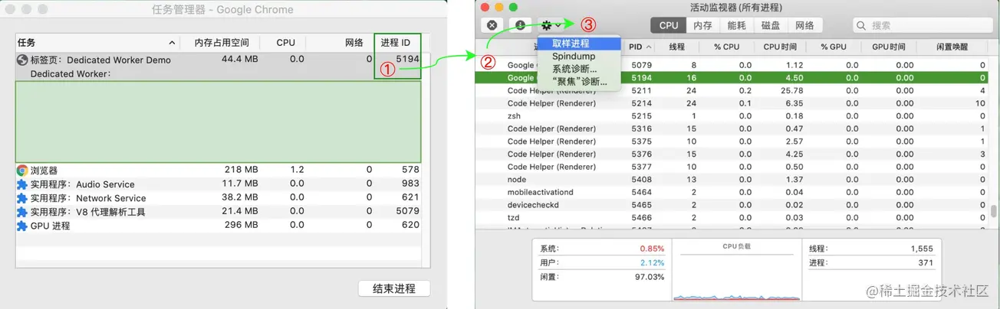
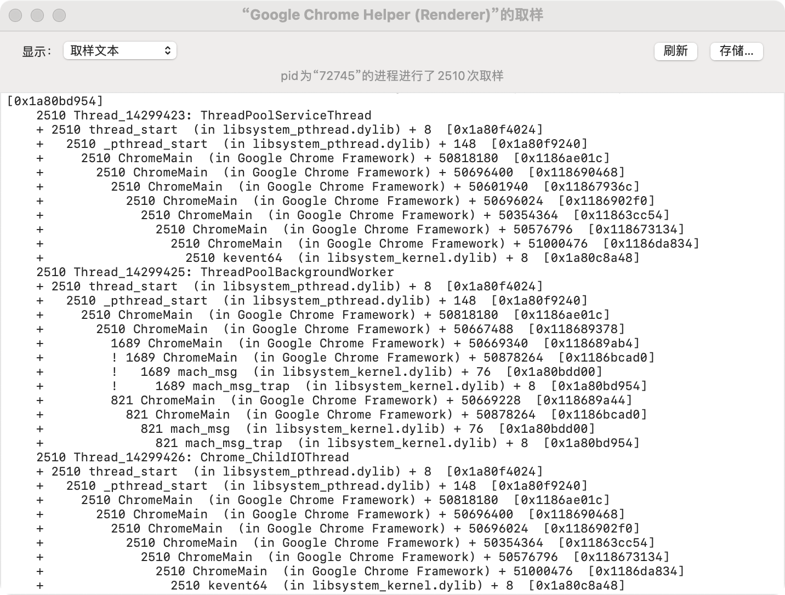
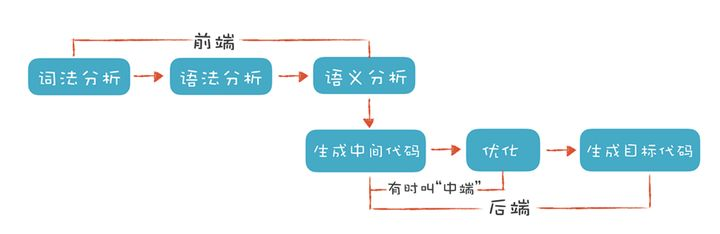
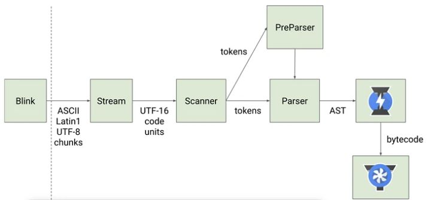
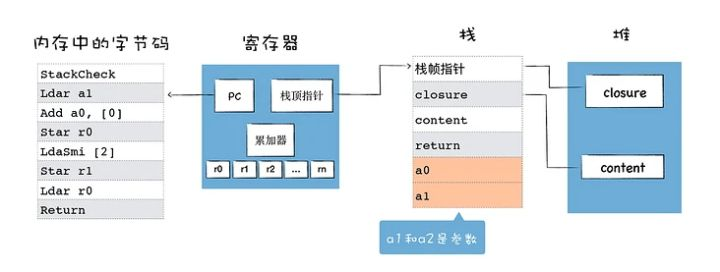
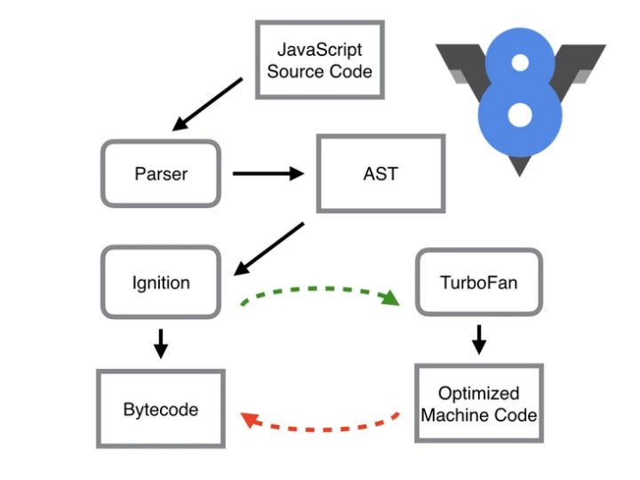
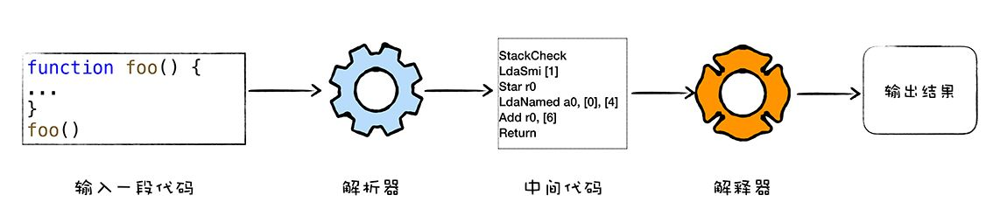
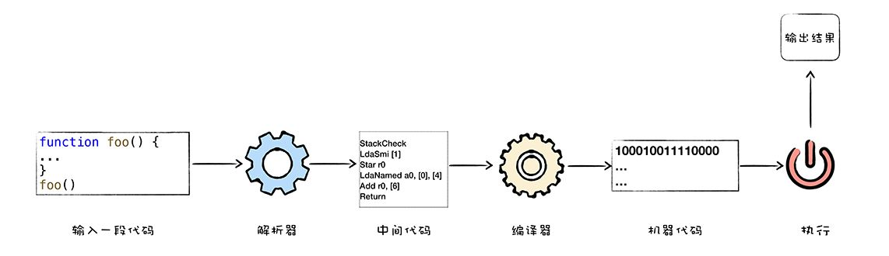
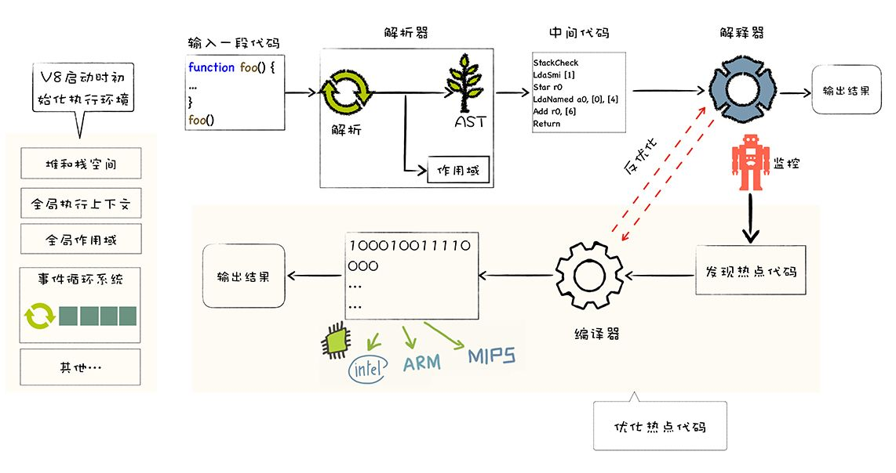

浏览器分为单进程架构和多进程架构。

浏览器单/多进程架构

## 一、浏览器单进程架构
浏览器所有功能都在一个进程内运行。

缺点
1. 不稳定：某个页面代码/插件崩了，导致浏览器整个就崩了。
2. 不流畅：某个页面代码执行耗时，会阻塞进程，导致其他页面的代码也没法响应；
3. 不安全：所有资源/数据都是公用的，可以获得操作系统权限，有安全风险。

## 二、浏览器多进程架构

浏览器各进程功能

### 浏览器主进程
  负责界面展示，用户交互，子进程管理，存储。
### 渲染进程
渲染进程将html，css，js转换成用户可交互等页面。渲染引擎blink和js引擎V8都运行在该进程中。
默认情况下，浏览器给每个tab页都分配一个渲染进程。彼此独立。处于安全考虑，渲染进程都运行在沙箱模式下。沙箱：不能在硬盘上写入任何数据，也不能在敏感位置读取任何数据。  
特殊情况：
- 一些性能较差的机器，浏览器这些进程还是会合并。
- 浏览器打开较多tab时，可能四五十个的时候，如果从一个页面打开了另个页面，且两个页面属于同一个站点的时，新页面会复用父页面的渲染进程，因此可以看到有时候一个页面崩溃，同一站点的其他页面也崩了。
- iframe也是单独一个进程。Site Isolation 机制从 Chrome 67 开始默认启用。这种机制允许在同一个 Tab 下的跨站 iframe 使用单独的进程来渲染，这样会更为安全。

扩展概念：
<tweet>
blink与v8的关系： blink是渲染引擎，v8是blink内置的js引擎。
</tweet>
<tweet>
webkit和blink的关系： webkit是apple主导的渲染引擎。chrome重构了下webkit，改名blink，大体架构相同。但是，webkit的js引擎是jscore，blink的js引擎是v8.
</tweet>

### 网络进程
  网络资源加载。
### GPU进程
  GPU最初是为了实现3d css效果，后来ui界面也都选择用GPU绘制。
### storage service
  访问文件等
### audio service
  处理音频
### 插件进程
因为插件质量良莠不齐，但它又运行在整个浏览器中，所以需要给他单独分配进程，避免插件崩溃对浏览器和页面造成影响
### 如何查看浏览器进程和线程
#### 查看进程
Chrome 任务管理器 & 活动监视器
Chrome 还为我们提供了「任务管理器」，供我们方便的查看当前浏览器中运行的所有进程及每个进程占用的系统资源，右键单击还可以查看更多类别信息。  
通过「页面右上角的三个点点点 --- 更多工具 --- 任务管理器」即可打开相关面板  

#### 查看线程

打开 Chrome 任务管理器之后，我们可以找到当前 Tab 页对应的进程 ID，即为 「5194」，接着我们打开 macOS 下的活动监视器，然后选中 「5194」 进程，然后对该进程进行取样操作：

取样完成后，可以看到当前渲染进程中完整的线程信息.

### 总结
多进程模型对缺点：
1. 更多的资源占用，因为每个进程都要分配单独的资源。
2. 更复杂的结构。

## 三、从输入地址到页面渲染完成的过程
### 1.用户输入地址

ui thread接收用户输入，判断是url还是query

### 2. 发起网络请求

ui thread通知network thread获取网页内容，并控制 tab 上的 spinner 展现，表示正在加载中。

network thread 会执行 DNS 查询，随后为请求建立 TLS 连接。
如果 network thread 接收到了重定向请求头如 301，network thread 会通知 UI thread 服务器要求重定向，之后，另外一个 URL 请求会被触发。

### 3. 读取响应

当请求响应返回的时候，network thread 会依据 Content-Type 及 MIME Type sniffing 判断响应内容的格式。
如果是HTML交给渲染进程，如果是文件，交给下载器。
[Safe Browsing](https://safebrowsing.google.com/) 检查也会在此时触发，如果域名或者请求内容匹配到已知的恶意站点，network thread 会展示一个警告页。此外[CORB](https://www.chromium.org/Home/chromium-security/corb-for-developers/) 检测也会触发确保敏感数据不会被传递给渲染进程。

### 4. 分配渲染进程

当上述所有检查完成，network thread 确信浏览器可以导航到请求网页，network thread 会通知 UI thread 数据已经准备好，UI thread 会查找到一个 renderer process 进行网页的渲染。
<tweet>
由于网络请求获取响应需要时间，这里其实还存在着一个加速方案。当 UI thread 发送 URL 请求给 network thread 时，浏览器其实已经知道了将要导航到那个站点。UI thread 会并行的预先查找和启动一个渲染进程，如果一切正常，当 network thread 接收到数据时，渲染进程已经准备就绪了，但是如果遇到重定向，准备好的渲染进程也许就不可用了，这时候就需要重启一个新的渲染进程。</tweet>

### 5. 确认导航

以上步骤都准备完毕后，Browser Process 会给 renderer process 发送 IPC 消息来确认导航，一旦 Browser Process 收到 renderer process 的渲染确认消息，导航过程结束，页面加载过程开始。

此时，地址栏会更新，展示出新页面的网页信息。history tab 会更新，可通过返回键返回导航来的页面，为了让关闭 tab 或者窗口后便于恢复，这些信息会存放在硬盘中。

### 6. 进行渲染

渲染进程几乎负责 Tab 内的所有事情，渲染进程的核心目的在于转换 HTML CSS JS 为用户可交互的 web 页面。  
主要流程包括确定文档结构，每个元素样式，坐标，以及绘制顺序，层级。  
渲染进程中主要包含以下线程：  
- 主线程 Main thread
- 工作线程 Worker thread
- 排版线程 Compositor thread
- 光栅线程 Raster thread

1. 构建dom  
当渲染进程接收到导航的确认信息，开始接受 HTML 数据时，主线程会解析文本字符串为 DOM树。

2. 加载次级资源  
网页中常常包含诸如图片，CSS，JS 等额外的资源，这些资源需要从网络上或者 cache 中获取。主进程可以在构建 DOM 的过程中会逐一请求它们，为了加速， preload scanner 会同时运行，如果在 html 中存在 `` `<link>` 等标签，preload scanner 会把这些请求传递给 Browser process 中的 network thread 进行相关资源的下载。

3. JS 的下载与执行  
当遇到 `<script>` 标签时，渲染进程会停止解析 HTML，而去加载，解析和执行 JS 代码，停止解析 html 的原因在于 JS 可能会改变 DOM 的结构（使用诸如 `document.write()`等API）。
不过开发者其实也有多种方式来告知浏览器应对如何应对某个资源，比如说如果在`<script>` 标签上添加了 `async` 或 `defer` 等属性，浏览器会异步的加载和执行JS代码，而不会阻塞渲染。更多的方法可参考 [Resource Prioritization – Getting the Browser to Help You](https://web.dev/fast/#prioritize-resources)

4. 样式计算  
仅仅渲染 DOM 还不足以获知页面的具体样式，主进程还会基于 CSS 选择器解析 CSS 获取每一个节点的最终的计算样式值。即使不提供任何 CSS，浏览器对每个元素也会有一个默认的样式。

样式计算

5. 获取布局，生成layput tree  
想要渲染一个完整的页面，除了获知每个节点的具体样式，还需要获知每一个节点在页面上的位置，布局其实是找到所有元素的几何关系的过程。其具体过程如下：

布局树

通过遍历 DOM 及相关元素的计算样式，主线程会构建出包含每个元素的坐标信息及盒子大小的布局树。布局树和 DOM 树类似，但是其中只包含页面可见的元素，如果一个元素设置了 `display:none` ，这个元素不会出现在布局树上，伪元素虽然在 DOM 树上不可见，但是在布局树上是可见的。

6. 绘制各元素  
即使知道了不同元素的位置及样式信息，我们还需要知道不同元素的绘制先后顺序才能正确绘制出整个页面。在绘制阶段，主线程会遍历布局树以创建绘制记录。绘制记录可以看做是记录各元素绘制先后顺序的笔记。
主线程依据布局树构建绘制记录

绘制

防止掉帧：
You can divide JavaScript operation into small chunks and schedule to run at every frame using requestAnimationFrame(). For more on this topic, please see Optimize JavaScript Execution . You might also run your JavaScript in Web Workers to avoid blocking the main thread.

7. 合成帧  
熟悉 PS 等绘图软件的童鞋肯定对图层这一概念不陌生，现代 Chrome 其实利用了这一概念来组合不同的层。

复合是一种分割页面为不同的层，并单独栅格化，随后组合为帧的技术。不同层的组合由 compositor 线程（合成器线程）完成。

主线程会遍历布局树来创建层树（layer tree），添加了 `will-change` CSS 

层树

你可能会想给每一个元素都添加上 `will-change`，不过组合过多的层也许会比在每一帧都栅格化页面中的某些小部分更慢。为了更合理的使用层，可参考 坚持仅合成器的属性和管理层计数 。

一旦层树被创建，渲染顺序被确定，主线程会把这些信息通知给合成器线程，合成器线程会栅格化（rasterizing）每一层。有的层的可以达到整个页面的大小，因此，合成器线程将它们分成多个磁贴，并将每个磁贴发送到栅格线程，栅格线程会栅格化每一个磁贴并存储在 GPU 显存中。

一旦磁贴被光栅化，合成器线程会收集称为绘制四边形的磁贴信息以创建合成帧。

合成帧随后会通过 IPC 消息传递给浏览器进程，由于浏览器的 UI 改变或者其它拓展的渲染进程也可以添加合成帧，这些合成帧会被传递给 GPU 用以展示在屏幕上，如果滚动发生，合成器线程会创建另一个合成帧发送给 GPU。

合成器的优点在于，其工作无关主线程，合成器线程不需要等待样式计算或者 JS 执行，这就是为什么合成器相关的动画 最流畅，如果某个动画涉及到布局或者绘制的调整，就会涉及到主线程的重新计算，自然会慢很多。

[Inside look at modern web browser (part 3)](https://developer.chrome.com/blog/inside-browser-part3/)
## 四、V8引擎
简单的说，v8是一款js引擎，为啥需要js引擎呢？
cpu只认识自己的指令集，指令集对应着汇编代码。并且不同类型的cpu的指令集是不同的。js引擎可以将js代码编译为不同cpu（intel，ARM，MIPS等）对应的汇编代码。

整个过程：高级语言-》汇编代码-》机器指令（二进制）。

v8则是chrome和nodejs，安卓设备在用的js引擎，也是目前使用最广泛的js引擎（也可称为js虚拟机）。
D8 是调试工具，用于查看v8在执行js过程中的各种中间数据，比如作用域、AST、字节码、优化的二进制代码、垃圾回收的状态，还可以使用 d8 提供的私有 API 查看一些内部信息。

v8引擎的内部结构
V8 是一个非常复杂的项目，有超过 100 万行 C++代码。它由许多子模块构成，其中这 4 个模块是最重要的：
### Parse
负责将js源代码转换为AST（抽象语法树：abstract syntax tree）。这里涉及到编译原理的知识，所以先理清下一些基础的编译原理的概念。

#### 编译原理的流程：

词法分析（lexical analysis或者scanning）和词法分析程序（lexical analyzer 或 scanner）：对源程序的字符流进行扫描，根据构词规则识别成单词。整个过程也就是“分词”。

语法分析（syntax analysis）和语法分析程序（parser）：将词法分析基础上的单词组合成各类型语法短句。如 if语句，for语句等。

语义分析（syntax analysis）：进行语义检查。
#### parse流程

### Ignition
<tweet>
即解释器，负责将 AST 转换为 Bytecode，解释执行 Bytecode；同时收集 TurboFan 优化编译所需的信息，比如函数参数的类型；解释器执行时主要有四个模块，内存中的字节码、寄存器、栈、堆。
</tweet>

#### 解释器的流程

参考资料：[解释器是如何解释执行字节码的?](https://time.geekbang.org/column/article/224908){:target="_blank"}

### TurboFan

 <tweet>
 compiler，即编译器，利用 Ignition 所收集的类型信息，将 Bytecode 转换为优化的汇编代码；
 </tweet>

### Orinoco

<tweet>
garbage collector，垃圾回收模块，负责将程序不再需要的内存空间回收。
</tweet>

总结：

简单地说，Parser 将 JS 源码转换为 AST，然后 Ignition 将 AST 转换为 Bytecode，最后 TurboFan 将 Bytecode 转换为经过优化的 Machine Code(实际上是汇编代码)。

### 编译执行和解释执行
解释执行

需要先将输入的源代码通过解析器编译成中间代码，之后直接使用解释器解释执行中间代码，然后直接输出结果。具体流程如下图所示：

编译执行

采用这种方式时，也需要先将源代码转换为中间代码，然后我们的编译器再将中间代码编译成机器代码。通常编译成的机器代码是以二进制文件形式存储的，需要执行这段程序的时候直接执行二进制文件就可以了。还可以使用虚拟机将编译后的机器代码保存在内存中，然后直接执行内存中的二进制代码。

总结：

解释执行和编译执行都有各自的优缺点
解释执行启动速度快，但是执行时速度慢，而编译执行启动速度慢，但是执行速度快。为了充分地利用解释执行和编译执行的优点，规避其缺点，V8 采用了一种权衡策略，在启动过程中采用了解释执行的策略，但是如果某段代码的执行频率超过一个值，那么 V8 就会采用优化编译器将其编译成执行效率更加高效的机器代码。

### V8 是怎么执行一段 JavaScript 代码的？
在 V8 出现之前，所有的 JavaScript 虚拟机所采用的都是解释执行的方式，「这是 JavaScript 执行速度过慢的一个主要原因」。而 V8 率先引入了即时编译（JIT）的双轮驱动的设计，这是一种权衡策略，混合编译执行和解释执行这两种手段，给 JavaScript 的执行速度带来了极大的提升。

另外，V8 也是早于其他虚拟机引入了惰性编译、内联缓存、隐藏类等机制，进一步优化了 JavaScript 代码的编译执行效率。V8 的出现，将 JavaScript 虚拟机技术推向了一个全新的高度。

接着通过下图，我们一起看看 V8 执行 JavaScript 代码的完整流程：

V8 执行一段 JavaScript 代码所经历的主要流程包括：

初始化基础环境；

解析源码生成 AST 和作用域；

依据 AST 和作用域生成字节码；

解释执行字节码；

监听热点代码；

优化热点代码为二进制的机器代码；

反优化生成的二进制机器代码。

V8编译流水线并不复杂，但其中涉及到了很多技术，诸如 JIT、延迟解析、隐藏类、内联缓存、事件循环系统、垃圾回收机制等等。这些技术决定着一段 JavaScript 代码能否正常执行，以及代码的执行效率。对提的几个名词做个简单介绍：

「隐藏类（Hide Class）」：是将 JavaScript 中动态类型转换为静态类型的一种技术，可以消除动态类型的语言执行速度过慢的问题。熟悉 了 V8 的工作机制，在编写 JavaScript 时，就能充分利用好隐藏类这种强大的优化特性，写出更加高效的代码。

「惰性解析」：它目的是为了加速代码的启动速度，通过对惰性解析机制的学习，可以优化代码更加适应这个机制，从而提高程序性能。

「V8事件循环系统」：事件循环系统和 JavaScript 中的难点异步编程特性紧密相关。JavaScript 是单线程的，JavaScript 代码都是在一个线程上执行，如果同一时间发送了多个 JavaScript 执行的请求，就需要排队，也就是进行异步编程。而V8事件循环系统会调度这些排队任务，保证 JavaScript 代码被 V8 有序地执行。因此也可以说，事件循环系统就是 V8 的心脏，它驱动了 V8 的持续工作。

「垃圾回收机制」：自动垃圾回收是一种在堆内存中找出哪些对象在被使用，还有哪些对象没被使用，并且将后者删掉的机制。所谓使用中的对象（已引用对象），指的是程序中有指针指向的对象；而未使用中的对象（未引用对象），则没有被任何指针给指向，因此占用的内存也可以被回收掉。而JavaScript 也是一种自动垃圾回收的语言。

